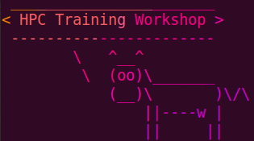

This series of 3 workshops will cover the basics of using the Cedars-Sinai
computer cluster for High Performance Computing (HPC).  

The HPC cluster is a valuable resource for computation-intensive analysis of
data.  Running data analysis pipelines on the cluster frees up resources on
your personal or lab computers, and gives you the ability to run hundreds or
thousands of analysis jobs in parallel.

In order to use the cluster, you need to be familiar with the Unix command line
environment, and you need to have some experience writing shell scripts.  In
these hands-on training classes, we will start with the basics of the Unix
command line, and then focus on writing shell scripts for the purpose of
running programs on the cluster.

1. Unix basics (Monday March 28) 
2. Scripting and cluster computing (Tuesday March 29)
3. Data analysis pipelines (Tuesday April 5)
4. Special topics (Wednesday April 6)

